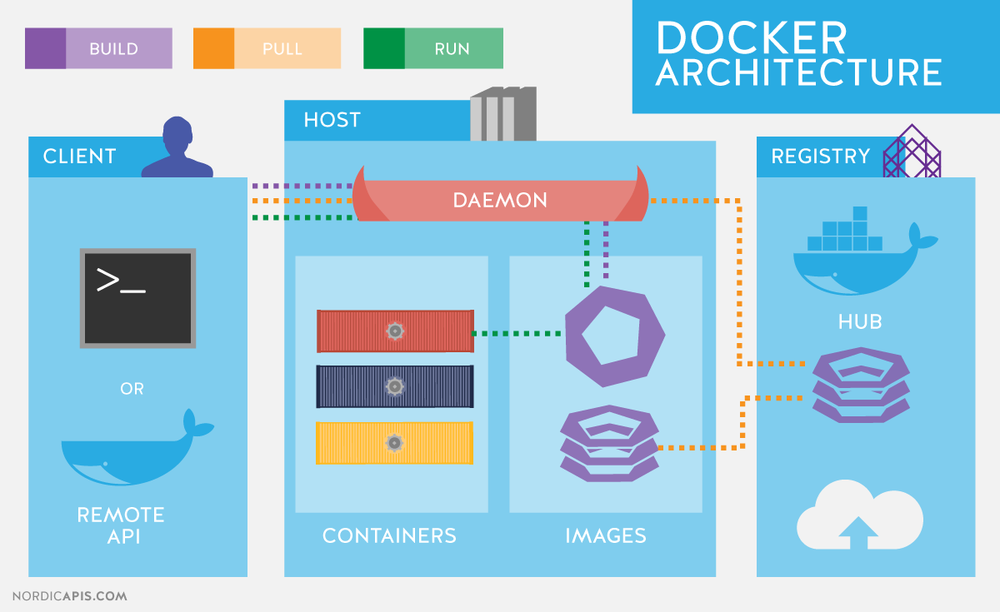
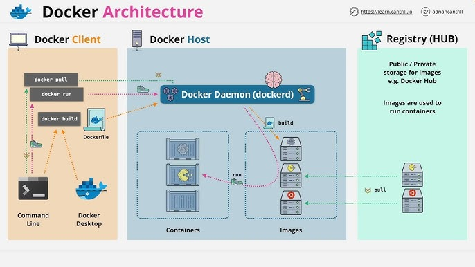
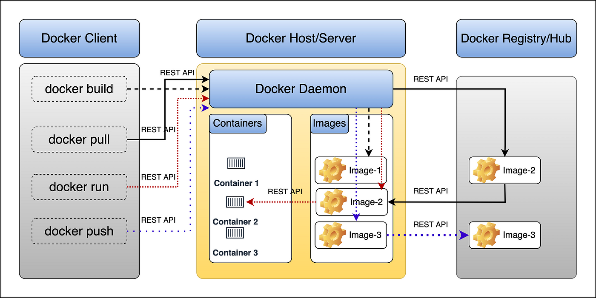

# **Comprehensive Explanation of Docker in Azure**

## **Definition**

Docker is an **open-source containerization platform** that allows developers to package applications and their dependencies into **lightweight, portable containers**. These containers can run consistently across different environments, from development to production.

In **Azure**, Docker is widely used for **containerized applications**, enabling fast deployment, scalability, and efficient resource utilization in cloud environments like **Azure Kubernetes Service (AKS)** and **Azure Container Instances (ACI)**.

---

## **Usage**

### **Where is Docker Used?**

- **Cloud Computing** – Running containerized applications in **Azure Kubernetes Service (AKS), Azure Container Instances (ACI)**.
- **Microservices Architecture** – Deploying independent, scalable services using Docker containers.
- **Continuous Integration & Continuous Deployment (CI/CD)** – Automating application deployments using **Azure DevOps with Docker**.
- **Hybrid & Multi-Cloud Environments** – Running applications consistently across **Azure, AWS, and on-premises**.
- **Application Modernization** – Migrating **legacy applications** into containerized environments for better efficiency.

### **Why is Docker Essential?**

- **Portability** – Containers run consistently across different environments (Dev, Test, Production).
- **Efficiency** – Uses fewer resources compared to virtual machines.
- **Scalability** – Quickly scale applications up or down in cloud environments.
- **Speed** – Containers start almost instantly compared to traditional VMs.
- **Security** – Provides **isolation** between applications, reducing the risk of conflicts.

### **When Should Docker Be Applied?**

- When deploying **scalable, microservices-based applications**.
- When running **CI/CD pipelines** for faster deployments.
- When migrating **monolithic applications** to a containerized environment.
- When managing applications across **multi-cloud or hybrid infrastructures**.
- When needing **resource-efficient, fast, and portable** deployment solutions.

---

## **Pros and Cons**

### **Advantages of Docker:**

✅ **Lightweight** – Uses fewer system resources than VMs.  
✅ **Faster Deployment** – Containers start in milliseconds.  
✅ **Portability** – Run containers anywhere (Azure, on-premises, hybrid).  
✅ **Scalability** – Easily scale services up/down.  
✅ **Consistent Environments** – Works the same across Dev, Test, and Prod.  
✅ **Microservices Ready** – Ideal for breaking down applications into smaller, independent services.

### **Limitations of Docker:**

❌ **Persistent Storage Management** – Requires additional setup for handling persistent data.  
❌ **Security Concerns** – Containers share the same OS kernel, increasing security risks.  
❌ **Networking Complexity** – Managing container networking across different hosts can be challenging.  
❌ **Learning Curve** – Requires knowledge of container orchestration tools like Kubernetes.

---

## **Requirements and Restrictions**

### **Prerequisites for Using Docker in Azure:**

1. **Docker Engine** – Installed on local or cloud-based infrastructure.
2. **Azure Subscription** – For deploying containers on Azure services.
3. **Container Registry (Optional)** – Azure Container Registry (ACR) for storing container images.
4. **Container Orchestration (Optional)** – AKS for managing multiple Docker containers.
5. **Networking Configuration** – Virtual networks for secure communication between containers.

### **Constraints and Limitations:**

- **Persistent Storage** – Containers are stateless by default; data must be stored externally.
- **Resource Allocation** – Poorly configured containers can consume excessive CPU/memory.
- **Security Vulnerabilities** – Running outdated or untrusted images can expose security risks.
- **Inter-Container Communication** – Requires additional networking setup for multiple container interaction.

---

## **Components and Features of Docker**

### **Key Components of Docker:**

1. **Docker Engine** – The runtime that builds and runs containers.
2. **Docker Image** – A lightweight, standalone package with everything needed to run an application.
3. **Docker Container** – A running instance of a Docker image.
4. **Dockerfile** – A script defining how to build a Docker image.
5. **Docker Hub/Azure Container Registry (ACR)** – A repository for storing and sharing container images.
6. **Docker Compose** – A tool for defining and running multi-container Docker applications.

### **Key Features of Docker:**

- **Image-Based Deployment** – Applications are packaged into images for consistent deployment.
- **Container Isolation** – Each container runs independently with its own resources.
- **Multi-Cloud & Hybrid Support** – Run Docker containers across different cloud platforms.
- **Networking & Volume Management** – Provides flexible networking and storage options.
- **Integration with CI/CD** – Works with **Azure DevOps, GitHub Actions, and Jenkins** for automated deployments.

### **Roles and Relationships of Components:**

- **Docker Engine** runs **Docker Containers**, which are based on **Docker Images**.
- **Dockerfile** defines how **Docker Images** are built.
- **Docker Compose** helps manage **multiple containers** in a single application.
- **Azure Kubernetes Service (AKS)** orchestrates multiple Docker containers at scale.

---

## **Real-Time Example and Use Case**

### **Example: Deploying a Docker Container in Azure**

**Scenario:** A company wants to deploy a **Python-based web application** in Azure using Docker.

**Steps to Implement Docker in Azure:**

1. **Create a Dockerfile:**
   ```Dockerfile
   FROM python:3.9
   WORKDIR /app
   COPY . /app
   RUN pip install -r requirements.txt
   CMD ["python", "app.py"]
   ```
2. **Build and Run the Container Locally:**
   ```bash
   docker build -t my-python-app .
   docker run -p 5000:5000 my-python-app
   ```
3. **Push the Image to Azure Container Registry (ACR):**
   ```bash
   az acr create --name myacr --sku Basic --resource-group myResourceGroup
   docker tag my-python-app myacr.azurecr.io/my-python-app:v1
   docker push myacr.azurecr.io/my-python-app:v1
   ```
4. **Deploy to Azure Container Instances (ACI):**
   ```bash
   az container create --name mycontainer \
       --resource-group myResourceGroup \
       --image myacr.azurecr.io/my-python-app:v1 \
       --dns-name-label myapp \
       --ports 5000
   ```

### **Real-World Scenario:**

A **financial services company** uses **Docker containers in AKS** to deploy a high-availability trading application. By leveraging containerization, the company can **scale workloads dynamically**, optimize costs, and ensure **faster application updates** with minimal downtime.

---

## **Interview Questions on Docker in Azure**

### **Definitions:**

1. What is Docker, and how does it work in Azure?
2. What is the difference between Docker and Virtual Machines?
3. What are the key components of a Docker container?

### **Scenario-Based Problems:**

1. How would you deploy a multi-container application in Azure using Docker?
2. What would you do if a containerized application is running slowly in Azure?
3. How would you ensure secure container deployments in Azure?

### **Conceptual or Practical Challenges:**

1. What are the security risks associated with Docker containers, and how can you mitigate them?
2. How does Azure Container Instances (ACI) differ from Azure Kubernetes Service (AKS)?
3. How would you set up **CI/CD** for a Docker-based application in Azure DevOps?

---

## **Conclusion**

Docker is a **powerful containerization platform** that provides **scalable, portable, and efficient** deployment solutions in **Azure**. By leveraging **Azure Container Instances (ACI), Azure Kubernetes Service (AKS), and Azure DevOps**, organizations can **build, manage, and scale** containerized applications with ease. 🚀

### **Docker vs. Virtualization: A Comparison Table**

| Feature                  | **Docker (Containerization)**                                                                        | **Virtualization (VMs)**                                                                                |
| ------------------------ | ---------------------------------------------------------------------------------------------------- | ------------------------------------------------------------------------------------------------------- |
| **Definition**           | A lightweight, OS-level virtualization that runs applications in isolated containers.                | A method that allows multiple operating systems to run on a single physical machine using a hypervisor. |
| **Architecture**         | Uses a **shared OS kernel**, with multiple containers running on top.                                | Uses a **hypervisor** to create and manage multiple virtual machines, each with its own OS.             |
| **Resource Utilization** | More efficient; shares the OS kernel and requires fewer system resources.                            | Heavier; each VM requires its own OS, consuming more CPU, RAM, and storage.                             |
| **Performance**          | Faster startup time (milliseconds) due to shared OS kernel.                                          | Slower startup time (minutes) as each VM has to boot its own OS.                                        |
| **Portability**          | Highly portable; containers can run on any platform that supports Docker.                            | Less portable; VMs require hypervisor compatibility.                                                    |
| **Isolation**            | Provides **process-level isolation** but shares the same OS kernel.                                  | Full isolation as each VM has its own OS.                                                               |
| **Security**             | Less secure than VMs since containers share the host OS kernel.                                      | More secure due to strong isolation between VMs.                                                        |
| **Scalability**          | Highly scalable; supports microservices architecture.                                                | Scalable but requires more resources per VM.                                                            |
| **Startup Time**         | Near-instant (milliseconds).                                                                         | Slow (minutes) due to OS boot-up.                                                                       |
| **Use Cases**            | Microservices, cloud-native applications, CI/CD pipelines, hybrid and multi-cloud environments.      | Running legacy applications, full OS environments, and scenarios requiring strong isolation.            |
| **Examples in Azure**    | **Azure Kubernetes Service (AKS), Azure Container Instances (ACI), Azure App Service (Containers)**. | **Azure Virtual Machines (VMs), Azure VMware Solution (AVS), Azure Stack HCI**.                         |
| **Best For**             | **Modern cloud-native applications** that need high efficiency and portability.                      | **Traditional enterprise applications** that require full OS environments and high security.            |

### **Conclusion**

- **Use Docker** when you need **fast, efficient, and portable** applications with minimal resource overhead.
- **Use Virtual Machines** when you need **strong isolation, legacy application support, or full OS environments**. 🚀

# **Docker Architecture**

Docker follows a **client-server architecture** that enables developers to **build, package, and run applications** in containers efficiently.

#### **Key Components of Docker Architecture:**

1. **Docker Client**

   - The interface through which users interact with Docker (via CLI or API).
   - Sends commands to the Docker Daemon.
   - Example commands: `docker run`, `docker build`, `docker push`.

2. **Docker Daemon (dockerd)**

   - The **core engine** that manages containers, images, networks, and storage.
   - Runs in the background on the host system.
   - Listens to requests from the Docker Client.

3. **Docker Images**

   - **Blueprints** for containers; contain application code, dependencies, and environment configurations.
   - Stored in **Docker Hub** or **Azure Container Registry (ACR)**.
   - Example: `python:3.9`, `nginx:latest`.

4. **Docker Containers**

   - **Lightweight, isolated runtime environments** created from Docker Images.
   - Run applications without needing a full OS for each instance.
   - Example: `docker run -d -p 80:80 nginx`.

5. **Docker Registries**

   - Repositories where Docker images are stored and shared.
   - Public registry: **Docker Hub**.
   - Private registry: **Azure Container Registry (ACR)**.

6. **Docker Network**

   - Enables communication between containers and external systems.
   - Types: **Bridge, Host, None, Overlay, Macvlan**.

7. **Docker Volume**
   - **Persistent storage** solution for Docker containers.
   - Used when containers need to retain data across restarts.

### **How Docker Works in Azure**

- **Docker images** are stored in **Azure Container Registry (ACR)**.
- **Containers** run on **Azure Kubernetes Service (AKS)** or **Azure Container Instances (ACI)**.
- **CI/CD pipelines** use Docker for **automated deployments** via **Azure DevOps**.








### **Conclusion**

Docker’s architecture ensures **fast, scalable, and portable application deployment**, making it ideal for **cloud-native** and **microservices-based** applications in **Azure**. 🚀

# **Key Docker Components with Details**

Docker is built on a **client-server architecture** that enables seamless containerized application development, deployment, and management. Below are the **key components** of Docker and their detailed descriptions:

---

### **1. Docker Engine**

The **Docker Engine** is the **core component** responsible for **building, running, and managing** containers. It consists of:

- **Docker Daemon (`dockerd`)** – Runs in the background, processes Docker commands, and manages container lifecycle.
- **REST API** – Enables communication between the Docker client and daemon.
- **CLI (Command-Line Interface)** – Allows users to interact with Docker via commands like `docker run`, `docker build`, `docker ps`.

📌 **Example Command:**

```bash
docker run -d -p 80:80 nginx
```

_(Runs an Nginx container in detached mode, exposing port 80)_

---

### **2. Docker Image**

A **Docker Image** is a **lightweight, portable, and immutable** blueprint used to create containers.

- **Contains application code, runtime, libraries, dependencies, and configurations.**
- **Stored in Docker Hub or Azure Container Registry (ACR).**

📌 **Example:**

```bash
docker pull python:3.9
```

_(Downloads the Python 3.9 image from Docker Hub)_

---

### **3. Docker Container**

A **Docker Container** is a **running instance** of a Docker image.

- **Isolated, lightweight, and portable execution environment.**
- **Shares the host OS kernel but runs independently.**
- **Can be started, stopped, and removed as needed.**

📌 **Example:**

```bash
docker run -it ubuntu /bin/bash
```

_(Runs an Ubuntu container with interactive shell access)_

---

### **4. Docker Registry**

A **Docker Registry** stores and manages Docker images.

- **Public Registry**: **Docker Hub** (default registry).
- **Private Registry**: **Azure Container Registry (ACR)**, Amazon ECR, Google Container Registry.

📌 **Example:**

```bash
docker push myacr.azurecr.io/my-app:v1
```

_(Pushes an image to Azure Container Registry)_

---

### **5. Dockerfile**

A **Dockerfile** is a script containing **instructions** to build a Docker image.

- Defines how the container environment should be set up.
- Used with `docker build` to create custom images.

📌 **Example Dockerfile:**

```Dockerfile
FROM node:14
WORKDIR /app
COPY . .
RUN npm install
CMD ["node", "server.js"]
```

_(Creates a Node.js environment for running an application)_

---

### **6. Docker Compose**

Docker Compose is a tool used to **define and run multi-container applications** using a `docker-compose.yml` file.

- Useful for defining **microservices, databases, and dependencies** in a single file.

📌 **Example `docker-compose.yml` File:**

```yaml
version: "3"
services:
  web:
    image: nginx
    ports:
      - "8080:80"
  db:
    image: mysql
    environment:
      MYSQL_ROOT_PASSWORD: example
```

_(Defines a web server and database service in a single configuration)_

📌 **Start Services Using:**

```bash
docker-compose up -d
```

_(Runs services in the background)_

---

### **7. Docker Volume**

A **Docker Volume** is used for **persistent data storage** that survives container restarts.

- Essential for databases and applications that require persistent data.

📌 **Example:**

```bash
docker volume create mydata
docker run -v mydata:/var/lib/mysql -d mysql
```

_(Creates a volume and attaches it to a MySQL container)_

---

### **8. Docker Network**

Docker **networking** enables communication between containers and external systems.

- **Types of Networks:**
  - **Bridge** – Default, allows isolated communication.
  - **Host** – Uses the host machine’s networking.
  - **None** – No networking.
  - **Overlay** – Used in Swarm for multi-host communication.

📌 **Example:**

```bash
docker network create my-network
docker run --network=my-network -d nginx
```

_(Creates a custom network and runs an Nginx container inside it)_

---

## **Conclusion**

Docker’s components—**Engine, Images, Containers, Registry, Compose, Volumes, and Networks**—work together to enable **fast, portable, and scalable** application deployment in cloud platforms like **Azure**. 🚀
